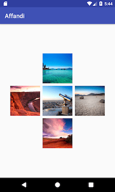
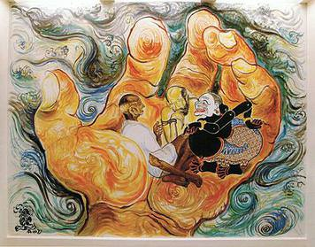

Affandi is an experimental Image Loading and Caching library. You can use this library to load an image using its URL to an `ImageView`. 



### Backlog:

- [x] Loading image through network
- [x] Caching image
- [ ] Multiple caching level
- [ ] Profiling

### Usage

```java
String imageUrl = "http://lorempixel.com/400/200/";
Affandi.with(context).paint(imageUrl).into(imageView);
```

You can use any `context` (application context, activity context, base context)

### Trivia:



[Affandi](https://en.wikipedia.org/wiki/Affandi) (1907 – 23 May 1990) is an artist which famous for its expresionist paintings.

